# Hi there, I'm Simone Cascioli 👋

### Mobile, Cloud & AI Security Software Engineer 🚀🛡️

I am a Full Stack Developer with over 5 years of hands-on experience, currently pursuing a B.Sc. in Computer Engineering at Politecnico di Bari. My playground lies at the intersection of robust mobile development and cloud security governance. 

With a background that bridges rigorous public cyber security training (including the Italian National Cybersecurity Agency - ACN) and scalable private sector architectures, I build applications that are not just fast, but secure by design.

---

### 🌌 What I'm Up To Right Now
- 🛠️ **Open Source:** Getting started with open-source contributions in Cloud Security and DevSecOps.
- 🧠 **AI Security:** Exploring the frontier of Large Language Models and AI agent security governance.
- 📱 **Mobile Architectures:** Refining scalable, serverless applications with Flutter and Cloud backend systems.

---

### 🛠️ My Tech Toolbox

#### 💻 Languages & Frameworks

#### ☁️ Cloud & Backend

#### ⚙️ DevOps & Tools

---

### 📊 GitHub Stats

  

  

---

### 🤝 Let's Connect!
- 🌐 **Personal Website:** [simonecascioli.it](https://www.simonecascioli.it)
- 💼 **LinkedIn:** [/in/simone-cascioli](https://linkedin.com/in/simone-cascioli)
- 📧 **Email:** info@simonecascioli.it

_"Security is not a product, but a process."_
